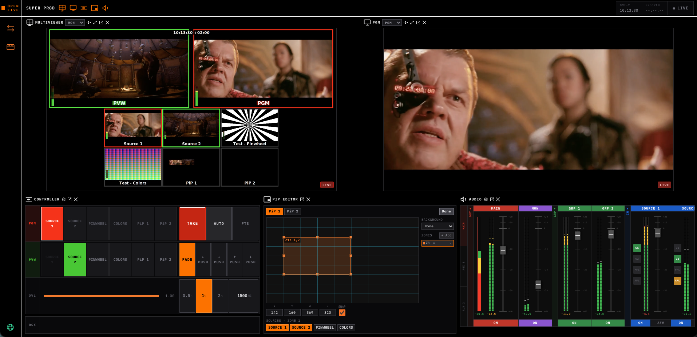

[](https://openlive.apps.osaas.io)



# open-live-studio

Open Live Studio is the browser-based production controller for Open Live, a cloud-native live broadcast production suite. It replaces traditional hardware vision mixers, audio consoles, and multiviewers with a fully browser-based workflow. The full production suite is hosted at [openlive.apps.osaas.io](https://openlive.apps.osaas.io).

This repository is the frontend UI. The backend API server lives in [open-live](https://github.com/Eyevinn/open-live).

Built with React 19, TypeScript, Vite, and TailwindCSS v4.

## Try it on OSC

The fastest way to try Open Live — no Kubernetes required.

Visit **[openlive.apps.osaas.io](https://openlive.apps.osaas.io)** to spin up a managed instance on Open Source Cloud. Start for an event, tear down after. No infrastructure to manage and no monthly minimum.

- 14-day free trial, free plan available
- 15 EUR/month (self-hosted Strom) or 69 EUR/month (shared GPU in Frankfurt)

## Features

- **Vision mixing** — cuts, auto transitions, DSK layers, picture-in-picture, graphics overlays, and fade-to-black
- **Audio mixer** — per-channel faders with EBU R128 loudness metering
- **Multiviewer** — sub-500ms WebRTC glass-to-glass latency
- **Stream Deck control** — hardware button panel integration
- **Up to 16 sources** per production
- **REMI / remote production** — crews work from anywhere via browser; eliminates travel and equipment shipping
- **Self-hostable** on any Kubernetes cluster, zero vendor lock-in

## Requirements

- Node.js 23+
- pnpm 10.33+
- [open-live](https://github.com/Eyevinn/open-live) backend running

## Setup

```bash
pnpm install
cp .env.example .env
# Edit .env if your backend runs on a different URL
```

## Environment variables

Copy `.env.example` to `.env`:

| Variable | Description | Default |
|---|---|---|
| `VITE_API_URL` | URL of the open-live backend API | `http://localhost:3000` |

> **`VITE_API_URL` is a build-time variable** — Vite bakes it into the bundle at compile time. For OSC deployments, set it in the app's parameter store _before_ building so it is picked up during the build step. Changing it after the build has no effect until a rebuild.

> **Never commit `.env`** — it is gitignored. Use `.env.example` as the reference.

> **`.env.production`** is committed and sets the default `VITE_API_URL` for production builds. The OSC parameter store value overrides it at build time if set.

## Commands

```bash
# Start development server (hot reload, connects to backend)
pnpm dev

# Type-check without building
pnpm typecheck

# Type-check and build for production
pnpm build

# Serve the production build (OSC deployment — respects $PORT, defaults to 8080)
pnpm start

# Preview the production build locally
pnpm preview

# Lint
pnpm lint
```

## Development

Start the [open-live](https://github.com/Eyevinn/open-live) backend first, then run `pnpm dev` here. The dev server runs on `http://localhost:5173` by default.

Sources and productions are polled from the backend every 5 seconds. All changes (add, remove, activate/deactivate) are persisted immediately via the REST API.

## OSC deployment

The app is deployed on [Open Source Cloud](https://www.osaas.io) using the `pnpm start` script. The `VITE_API_URL` parameter must be set in the app's OSC parameter store before deployment so Vite can bake the correct backend URL into the bundle at build time.

Set `CORS_ORIGIN` on the backend to this app's OSC URL and restart the backend whenever this app's URL changes.
