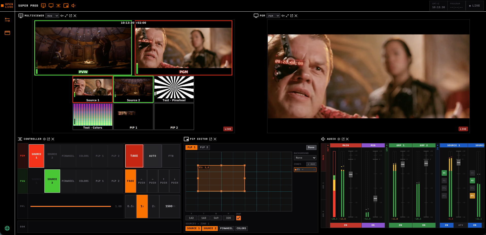

[](https://openlive.apps.osaas.io)



# open-live-studio

Open Live Studio is the browser-based production controller for Open Live, a cloud-native live broadcast production suite. It replaces traditional hardware vision mixers, audio consoles, and multiviewers with a fully browser-based workflow. The full production suite is hosted at [openlive.apps.osaas.io](https://openlive.apps.osaas.io).

This repository is the frontend UI. The backend API server lives in [open-live](https://github.com/Eyevinn/open-live).

Built with React 19, TypeScript, Vite, and TailwindCSS v4.

## Try it on OSC

The fastest way to try Open Live — no Kubernetes required.

Visit **[openlive.apps.osaas.io](https://openlive.apps.osaas.io)** to spin up a managed instance on Open Source Cloud. Start for an event, tear down after. No infrastructure to manage and no monthly minimum.

- 14-day free trial, free plan available
- 15 EUR/month (self-hosted Strom) or 69 EUR/month (shared GPU in Frankfurt)

## Features

- **Vision mixing** — cuts, auto transitions, DSK layers, picture-in-picture, graphics overlays, and fade-to-black
- **Audio mixer** — per-channel faders with EBU R128 loudness metering
- **Multiviewer** — sub-500ms WebRTC glass-to-glass latency
- **Stream Deck control** — hardware button panel integration
- **Up to 16 sources** per production
- **REMI / remote production** — crews work from anywhere via browser; eliminates travel and equipment shipping
- **Self-hostable** on any Kubernetes cluster, zero vendor lock-in

## Requirements

- Node.js 23+
- pnpm 10.33+
- [open-live](https://github.com/Eyevinn/open-live) backend running

## Setup

```bash
pnpm install
cp .env.example .env
# Edit .env if your backend runs on a different URL
```

## Environment variables

Copy `.env.example` to `.env`:

| Variable | Description | Default |
|---|---|---|
| `OPEN_LIVE_URL` | URL of the open-live backend API | `http://localhost:3000` |

> **`OPEN_LIVE_URL` is resolved at runtime, not baked in at build time.** `src/lib/base.ts` resolves the backend URL as `window._env_?.OPEN_LIVE_URL || import.meta.env.OPEN_LIVE_URL || 'http://localhost:3000'`, so the **runtime** `window._env_` value takes precedence. Both serving paths write `window._env_` when the container/process starts: the Docker image's `docker-entrypoint.sh` generates `env-config.js` in the served root, and the non-Docker `pnpm start` script writes `dist/env-config.js`. Changing `OPEN_LIVE_URL` therefore takes effect on restart — no rebuild required. For OSC deployments, set it in the app's parameter store; it is injected into the container environment at start.

> **Why not `VITE_API_URL`?** `vite.config.ts` sets `envPrefix: ['OPEN_LIVE_']`, which **replaces** Vite's default `VITE_` prefix. A `VITE_`-prefixed variable is never exposed to the bundle, so only `OPEN_LIVE_`-prefixed variables are picked up.

> **Never commit `.env`** — it is gitignored. Use `.env.example` as the reference.

### Idle auto-deactivation (`IDLE_TIMEOUT_SEC`)

An active production is automatically deactivated by the backend after it has had **zero controller subscribers** for a set period. That period is controlled by the **backend** environment variable `IDLE_TIMEOUT_SEC` (defined in [open-live](https://github.com/Eyevinn/open-live) `src/config.ts`, default `300` seconds). It is **not** a Studio variable — set it on the open-live backend (for OSC deployments, in the backend app's parameter store), then restart the backend.

Studio surfaces this timeout so an operator is never caught out by it:

- The **Productions** list shows a per-row countdown badge as a production nears its idle deadline.
- A **session-wide banner** (mixer, I/O and Productions views) warns when the selected production is within the last minute of its idle window with no viewers, with a one-click link back to the mixer.
- The **mixer view** additionally offers a one-click *Keep active* action.

While any Studio view for a production is open, Studio holds a lightweight keep-alive that resets this backend timer, so routine setup work does not trigger a deactivation. Lowering `IDLE_TIMEOUT_SEC` reclaims idle-but-active GPU capacity sooner; raising it is more forgiving of brief operator absences.

## Commands

```bash
# Start development server (hot reload, connects to backend)
pnpm dev

# Type-check without building
pnpm typecheck

# Type-check and build for production
pnpm build

# Serve the production build (OSC deployment — respects $PORT, defaults to 8080)
pnpm start

# Preview the production build locally
pnpm preview

# Lint
pnpm lint
```

## Development

Start the [open-live](https://github.com/Eyevinn/open-live) backend first, then run `pnpm dev` here. The dev server runs on `http://localhost:5173` by default.

Sources and productions are polled from the backend every 5 seconds. All changes (add, remove, activate/deactivate) are persisted immediately via the REST API.

## OSC deployment

The app is deployed on [Open Source Cloud](https://www.osaas.io) using the `pnpm start` script. Set the `OPEN_LIVE_URL` parameter in the app's OSC parameter store; it is read from the container environment at start and written into `window._env_` (via `docker-entrypoint.sh` for the Docker image, or `pnpm start` for the non-Docker path), so the correct backend URL is picked up at runtime without a rebuild.

> **The Docker image (`Dockerfile`) is the canonical production serving path.** It uses nginx with security headers (including `X-Frame-Options`) enabled by default. The `pnpm start` path exists for local preview and quickstart development; for production use, prefer the Docker image.

Set `CORS_ORIGIN` on the backend to this app's OSC URL and restart the backend whenever this app's URL changes.
